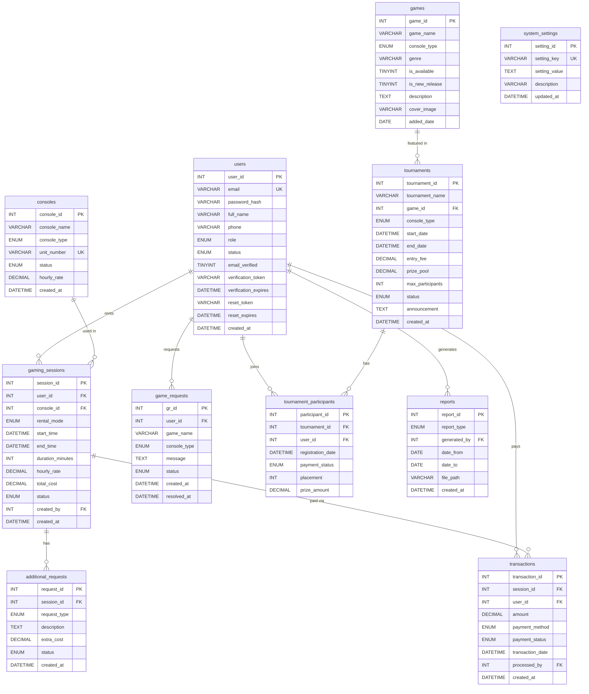

# GamingSpotHub — Database Structure & Constraints

**Date:** February 21, 2026  
**Author:** Development Team  
**Database:** `gamingspothub` (MySQL 5.7+, InnoDB, utf8mb4)

---

## Entity-Relationship Diagram

---

## Table Details

### Table 1: `users`

Central user table for all roles.

| Column | Type | Constraints | Description |
|---|---|---|---|
| `user_id` | INT | PK, AUTO_INCREMENT | Unique user ID |
| `email` | VARCHAR(100) | NOT NULL, UNIQUE | Login email |
| `password_hash` | VARCHAR(255) | NOT NULL | bcrypt hash |
| `full_name` | VARCHAR(100) | NOT NULL | Display name |
| `phone` | VARCHAR(20) | DEFAULT NULL | Optional phone |
| `role` | ENUM | NOT NULL, DEFAULT 'customer' | `customer`, `shopkeeper`, `owner` |
| `status` | ENUM | NOT NULL, DEFAULT 'active' | `active`, `inactive` |
| `email_verified` | TINYINT(1) | NOT NULL, DEFAULT 0 | 0 = unverified, 1 = verified |
| `verification_token` | VARCHAR(64) | DEFAULT NULL | Email verification token (64-char hex) |
| `verification_expires` | DATETIME | DEFAULT NULL | Token expires after 24 hours |
| `reset_token` | VARCHAR(64) | DEFAULT NULL | Password reset token (64-char hex) |
| `reset_expires` | DATETIME | DEFAULT NULL | Token expires after 1 hour |
| `created_at` | DATETIME | DEFAULT CURRENT_TIMESTAMP | Registration date |

**Indexes:** `idx_users_role`, `idx_users_status`

> **Auth columns** (`email_verified` through `reset_expires`) are added via `migration_auth.sql` and are not in the base `schema.sql`.

---

### Table 2: `consoles`

Physical gaming units in the shop.

| Column | Type | Constraints | Description |
|---|---|---|---|
| `console_id` | INT | PK, AUTO_INCREMENT | Unique console ID |
| `console_name` | VARCHAR(50) | NOT NULL | e.g., "PS5 Unit A" |
| `console_type` | ENUM | NOT NULL | `PS5`, `Xbox Series X` |
| `unit_number` | VARCHAR(10) | NOT NULL, UNIQUE | Physical label, e.g., "PS5-01" |
| `status` | ENUM | NOT NULL, DEFAULT 'available' | `available`, `in_use`, `maintenance` |
| `hourly_rate` | DECIMAL(10,2) | NOT NULL, DEFAULT 0.00 | Rate per hour in PHP (₱) |
| `created_at` | DATETIME | DEFAULT CURRENT_TIMESTAMP | Date added |

**Indexes:** `idx_consoles_status`, `idx_consoles_type`

---

### Table 3: `gaming_sessions`

Active and past rental sessions.

| Column | Type | Constraints | Description |
|---|---|---|---|
| `session_id` | INT | PK, AUTO_INCREMENT | Unique session ID |
| `user_id` | INT | FK → `users.user_id` | Customer renting |
| `console_id` | INT | FK → `consoles.console_id` | Console being used |
| `rental_mode` | ENUM | NOT NULL | `hourly`, `open_time`, `unlimited` |
| `start_time` | DATETIME | NOT NULL, DEFAULT NOW() | Session start |
| `end_time` | DATETIME | DEFAULT NULL | Session end (NULL = still active) |
| `duration_minutes` | INT | DEFAULT NULL | Calculated after session ends |
| `hourly_rate` | DECIMAL(10,2) | NOT NULL, DEFAULT 0.00 | Rate snapshot at booking |
| `total_cost` | DECIMAL(10,2) | DEFAULT NULL | Calculated after session ends |
| `status` | ENUM | NOT NULL, DEFAULT 'active' | `active`, `completed`, `cancelled` |
| `created_by` | INT | FK → `users.user_id` | Staff who started the session |
| `created_at` | DATETIME | DEFAULT CURRENT_TIMESTAMP | Record created |

**Foreign Keys:**
- `fk_sessions_user` → `users(user_id)` ON DELETE RESTRICT
- `fk_sessions_console` → `consoles(console_id)` ON DELETE RESTRICT
- `fk_sessions_created_by` → `users(user_id)` ON DELETE RESTRICT

**Business Rule:** A console's `status` should be set to `in_use` when a session starts and back to `available` when it ends. This is handled in application code, not by DB triggers.

---

### Table 4: `additional_requests`

Extra services during a session.

| Column | Type | Constraints | Description |
|---|---|---|---|
| `request_id` | INT | PK, AUTO_INCREMENT | Unique request ID |
| `session_id` | INT | FK → `gaming_sessions.session_id` | Parent session |
| `request_type` | ENUM | NOT NULL | `extra_hours`, `controller_rental`, `other` |
| `description` | TEXT | DEFAULT NULL | Details of the request |
| `extra_cost` | DECIMAL(10,2) | NOT NULL, DEFAULT 0.00 | Additional charge |
| `status` | ENUM | NOT NULL, DEFAULT 'pending' | `pending`, `approved`, `denied` |

**Foreign Keys:**
- `fk_addreq_session` → `gaming_sessions(session_id)` ON DELETE **CASCADE** (requests removed if session deleted)

---

### Table 5: `transactions`

Payment records linked to sessions.

| Column | Type | Constraints | Description |
|---|---|---|---|
| `transaction_id` | INT | PK, AUTO_INCREMENT | Unique transaction ID |
| `session_id` | INT | FK → `gaming_sessions.session_id` | Session being paid for |
| `user_id` | INT | FK → `users.user_id` | Customer paying |
| `amount` | DECIMAL(10,2) | NOT NULL, DEFAULT 0.00 | Amount in PHP (₱) |
| `payment_method` | ENUM | NOT NULL, DEFAULT 'cash' | `cash`, `gcash`, `credit_card` |
| `payment_status` | ENUM | NOT NULL, DEFAULT 'pending' | `pending`, `completed`, `failed` |
| `processed_by` | INT | FK → `users.user_id` | Staff who processed payment |

**Foreign Keys:**
- `fk_trans_session` → `gaming_sessions(session_id)` ON DELETE RESTRICT
- `fk_trans_user` → `users(user_id)` ON DELETE RESTRICT
- `fk_trans_processed_by` → `users(user_id)` ON DELETE RESTRICT

---

### Table 6: `games`

Available game library.

| Column | Type | Constraints | Description |
|---|---|---|---|
| `game_id` | INT | PK, AUTO_INCREMENT | Unique game ID |
| `game_name` | VARCHAR(150) | NOT NULL | Title |
| `console_type` | ENUM | NOT NULL | `PS5`, `Xbox Series X`, `Both` |
| `genre` | VARCHAR(50) | DEFAULT NULL | e.g., "FPS", "RPG" |
| `is_available` | TINYINT(1) | NOT NULL, DEFAULT 1 | Currently playable |
| `is_new_release` | TINYINT(1) | NOT NULL, DEFAULT 0 | New release tag |
| `cover_image` | VARCHAR(255) | DEFAULT NULL | Image file path |

---

### Table 7: `game_requests`

Customer requests for new games.

| Column | Type | Constraints | Description |
|---|---|---|---|
| `gr_id` | INT | PK, AUTO_INCREMENT | Unique request ID |
| `user_id` | INT | FK → `users.user_id` | Requesting customer |
| `game_name` | VARCHAR(150) | NOT NULL | Game they want installed |
| `console_type` | ENUM | NOT NULL | `PS5`, `Xbox Series X` |
| `status` | ENUM | NOT NULL, DEFAULT 'pending' | `pending`, `approved`, `installed`, `denied` |

---

### Table 8: `tournaments`

Monthly gaming events.

| Column | Type | Constraints | Description |
|---|---|---|---|
| `tournament_id` | INT | PK, AUTO_INCREMENT | Unique tournament ID |
| `tournament_name` | VARCHAR(150) | NOT NULL | Event title |
| `game_id` | INT | FK → `games.game_id` | Featured game |
| `entry_fee` | DECIMAL(10,2) | DEFAULT 0.00 | Per-player fee in ₱ |
| `prize_pool` | DECIMAL(10,2) | DEFAULT 0.00 | Total prizes in ₱ |
| `max_participants` | INT | DEFAULT 16 | Player cap |
| `status` | ENUM | DEFAULT 'upcoming' | `upcoming`, `ongoing`, `completed`, `cancelled` |

---

### Table 9: `tournament_participants`

Player registrations with a **unique constraint** preventing duplicate entries.

| Column | Type | Constraints | Description |
|---|---|---|---|
| `participant_id` | INT | PK, AUTO_INCREMENT | Unique entry ID |
| `tournament_id` | INT | FK → `tournaments.tournament_id` | Which tournament |
| `user_id` | INT | FK → `users.user_id` | Which player |
| `payment_status` | ENUM | DEFAULT 'pending' | `pending`, `paid` |
| `placement` | INT | DEFAULT NULL | Final rank (1st, 2nd, etc.) |

**Unique Key:** `uk_tp_entry(tournament_id, user_id)` — a user can only register once per tournament.

**ON DELETE:** CASCADE from tournaments (removing a tournament removes all participants).

---

### Table 10: `reports`

Generated reports for the owner.

| Column | Type | Constraints | Description |
|---|---|---|---|
| `report_id` | INT | PK, AUTO_INCREMENT | Unique report ID |
| `report_type` | ENUM | NOT NULL | `daily_sales`, `rental_records`, `console_usage`, `tournament` |
| `generated_by` | INT | FK → `users.user_id` | Staff who generated |
| `date_from` | DATE | NOT NULL | Report start range |
| `date_to` | DATE | NOT NULL | Report end range |
| `file_path` | VARCHAR(255) | DEFAULT NULL | Saved report file |

---

### Table 11: `system_settings`

Key-value shop configuration.

| Column | Type | Constraints | Description |
|---|---|---|---|
| `setting_id` | INT | PK, AUTO_INCREMENT | Unique setting ID |
| `setting_key` | VARCHAR(50) | NOT NULL, UNIQUE | e.g., "shop_name", "opening_hours" |
| `setting_value` | TEXT | NOT NULL | The value |
| `updated_at` | DATETIME | AUTO-UPDATE | Last modified timestamp |

---

## Foreign Key Summary

| FK Name | From | → To | ON DELETE |
|---|---|---|---|
| `fk_sessions_user` | `gaming_sessions.user_id` | `users.user_id` | RESTRICT |
| `fk_sessions_console` | `gaming_sessions.console_id` | `consoles.console_id` | RESTRICT |
| `fk_sessions_created_by` | `gaming_sessions.created_by` | `users.user_id` | RESTRICT |
| `fk_addreq_session` | `additional_requests.session_id` | `gaming_sessions.session_id` | CASCADE |
| `fk_trans_session` | `transactions.session_id` | `gaming_sessions.session_id` | RESTRICT |
| `fk_trans_user` | `transactions.user_id` | `users.user_id` | RESTRICT |
| `fk_trans_processed_by` | `transactions.processed_by` | `users.user_id` | RESTRICT |
| `fk_gr_user` | `game_requests.user_id` | `users.user_id` | RESTRICT |
| `fk_tourn_game` | `tournaments.game_id` | `games.game_id` | RESTRICT |
| `fk_tp_tournament` | `tournament_participants.tournament_id` | `tournaments.tournament_id` | CASCADE |
| `fk_tp_user` | `tournament_participants.user_id` | `users.user_id` | RESTRICT |
| `fk_reports_user` | `reports.generated_by` | `users.user_id` | RESTRICT |

> **RESTRICT** = cannot delete a user/console/session while dependent records exist.  
> **CASCADE** = deleting a parent automatically deletes all children.

---

## SQL Files Reference

| File | Purpose | When to Run |
|---|---|---|
| `database/schema.sql` | Creates all 11 tables | First-time setup |
| `database/migration_auth.sql` | Adds auth columns to `users` | After schema.sql |
| `database/sample_data.sql` | Inserts test data | Optional, for dev/testing |
